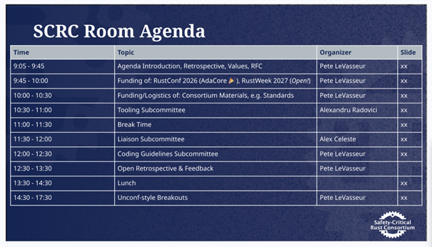

# Safety Critical Rust Consortium Meeting on 21 May 2026 @ 9 AM CET, Utrecht, Netherlands

| Search Key | Description |
| :---- | :---- |
| \[todo\] | Action Item |
| \[decision\] | Something decided on |
| \[important\] | Key information |

## Agenda

****

## Check-in area

**Please add your name, and an emoji that describes your day.**

* Christof Petig 🇳🇱  
* Pete LeVasseur 🍵  
* Julius Gustavssson 🦀  
* Samuel Wright 🚴  
* Manuel Hatzl 🥐  
* Andrew Herridge 😀  
* Arnaud Fontaine 😃  
* William Barsse  

**Notetaker:**

* Christof Petig

## Housekeeping section

* 

## Tasks

* Pete: Get microphone(s) useful for holding in-person SCRC events to aid remote attendees

## Meeting Minutes

* Afternoon is meant to start new discussions in an unconference style  
* Introduction by Pete [https://docs.google.com/presentation/d/1H9A9i-8RUO5\_XJbmR43sbNlX8IirlVbbJG2Uv2bCa0g/edit?usp=sharing](https://docs.google.com/presentation/d/1H9A9i-8RUO5_XJbmR43sbNlX8IirlVbbJG2Uv2bCa0g/edit?usp=sharing)   
  * Agreed that non-differentiating parts can be shared across companies  
  * Mentioned the MC/DC merge then remove example from Niko’s talk  
  * RFC: Only one RFC active  
  * An umbrella meeting across sub-groups could make sense regularly (proposal)  
  * AdaCore will sponsor RustConf, Rustweek sponsoring will be discussed at RustConf  
  * Access to standards: Local library might be an option, ISO 26262 should be available, costs $2000, no funding yet  
    * [Archive.org](http://Archive.org) has copies of Indian standard copies which likely aren’t legal to use outside of the country but available  
    * Pete to check when the new revision will be published, we should delay buying a copy if reasonable  
    * We should also check for the refresh dates for the other standard we plan to buy  
    * \[todo\] Maybe the liaison subgroup can figure out an agreement  
    * \[todo\] Pete to check for a similar solution implemented on eclipse SDV s-core  
* Tooling subcommittee  
  * Rust commercial network is promising, we might want to move the SCRC to the RCN as well  
  * Rust goal is considered a huge success  
  * SCRC needs to provide the work for clippy but it is agreed on  
  * Cooperation between coding guidelines and clippy implementation should deepen  
  * The flow should be CERT-C \-\> Coding guideline \-\> clippy lint implementation  
    * Pete to document this process  
  * The contribute work to use agreement of eclipse or AUTOSAR could be a financial way for clippy, technically the Rust foundation would be the right entity  
    * \[todo\] Coming up with a plan for this could be part of the unconference  
  * JA1020 contains a list of clippy lint recommendations, but this list has to be refreshed with new compiler releases. The reasoning is mentioned in JA1020.  
  * [https://arewesafetycriticalyet.org/tooling/rfc-tools-review](https://arewesafetycriticalyet.org/tooling/rfc-tools-review) is available, big effort to create  
  * Website is rendered from a JSON list with categories [https://arewesafetycriticalyet.org/tooling/tools-list](https://arewesafetycriticalyet.org/tooling/tools-list)   
    * The tool communication with vendors would need a communication method, github pull requests seem to be fine  
  * The Aerospace standard mentioned is extended by the related standards DO-330, DO-332, DO-333 (potentially more), but this is not obvious to non-avionic experts  
* Liaison subcommittee  
  * WG23: At least five people are needed  
  * Rust would do well to mimic the other languages in safety practices, better be boring even though novel approaches would be viable as well   
  * Subcommittee will awake and get more communication started between members  
* Coding guidelines subcommittee  
  * Companies will give the existing proposal a test drive internally to see how it pans out.  
  * The current status   
  * Collecting a list of Rust problems which are unique to the language  
    * E.g. panic  
    * CVEs could be a good source, but a lot of them are OS specific  
    * \[todo\] We should create a subgroup to look into CVEs for common patterns  
  * \[todo\] Oreste to talk to Felix to continue the CERT-C to Rust mapping (format conversion to rst),   
    Note. Markus is currently working on the MISRA-C equivalences  
  * We expect coding guidelines to be not ideal in the start, for now all of them are draft, please use them and provide feedback  
  * The guidelines can’t be perfect at the start, Incomplete is ok, incorrect is not ok  
  * More people could join the call with eclipse to gather feedback, more companies invited to try internally  
  * The bot will be turned on once the spammy behavior is taken care of. It will be turned on later.  
  * Review should be considered help, not criticism, to create something good collaboratively  
* ISO 26262 mandates a coding guideline, it doesn’t specify with. Likely the guideline will need to be tweaked for a specific organizational situation. Aerospace and medical mandates a standard as well. MISRA C Rust addendum can act as a starting point.  
  * \[todo\] Missing feature in Clippy: Report generation  
  * Releases of the guidelines need to be versioned. Open issue to host multiple standards. CERT-C is unversioned and this hurts adoption.  
* Open round  
  * CERT-C is blocked by overzealous blocking of pages hosted at github by company firewalls, we should check whether [arewesafetycriticalyet.org](http://arewesafetycriticalyet.org) is also affected  
  * Procurement for existing safety qualified compilers is established, Rust might suffer from internal procurement hurdles which the other languages already passed years ago.  
  * Assessors rely on prior art, how can we simplify these things? Rust is new, so it is perceived as unproven. How can we communicate Rust’s usage across the industry more?  
    * Proven case studies are helpful  
    * In aviation the assessors are internal  
    * We might leverage certification authorities advertising as more future oriented  
  * One project got into trouble for a debugger support for Rust not being available. The support might be incomplete.  
    * This might be the case of ancient lock in, so a list of supported tools (with the incentive for more tools getting on the list).  
    * S-core could look into publishing their working tool list as an example  
  * Missing processes delay projects and cause potential investments and then prevent Rust  
  * Companies investing time and money and being public about it help the case. “Are we X yet?” is a flawed communication because the readiness question permeates.  
    * Alexandru to talk with Joel about domain naming  
    * Pete to talk to Communication again    
    * Pete to collect case entries for a white paper about getting Rust to safety  
  * 

## Rust Embedded WG

Some SoC vendors and users that were getting together were talking about how to pool resources to accomplish things.

Some Rust Embedded WG members wanted to discuss with us about some shared features and things we might need, such as stack protection.

As we in the SCRC and member companies start to develop in safety-critical spaces, then when moving software onto hardware we may want to collaborate.

An entity needs to be created within the Rust Commercial Network

Could have some side conversations within the SCRC until new group spun up within.

## Unconf Topics

### Clippy On-boarding

Clippy Team seems up for doing the report generation, but they’d like to have details.

Pete: Coordinate with Clippy team, discuss among SCRC on details.

### Whitepaper for Testimonials of Rust Adoption

5

### CVE Deep Dive for Problematic Patterns

8

### Tooling Maturity around Compiler (Testing, Code Coverage)

5

### When Atomics are not Atomic

5

### Tool Qualification & Software Certification

5

Unsure of next ISO 26262 publish date.

Wanted to know about create certification process; has this been detailed? Is there a process that’s well-known?

If working with non-certified software have to treat as-if own software and do lots of testing, verification, requirements, design traceability.

Most crates in the ecosystem today likely don’t follow that process.

How to do this ourselves? Or wait for crate certification?

Tool Qualification: MC/DC in the compiler still would need to be qualified.

Currently looking at ISO 26262 ASIL B certification for products.

C0, C1 still okay for ASIL B. C0, C1 available, but not qualified currently. Need to do self or ask it of someone?

Eclipse S-CORE presents software that is designed, written in a way that’s intended to be safety-certifiable: tests, requirements, design, code traceability.

As a user of crates, either someone certified it or not. Fork the crate, do the job of changes to safety-certification. Unsure if that kind of updates for safety-certification can be contributed back to the open source.

Seems challenging to certify a crate, let alone more than one crate.

With crate certification from a vendor perspective, there’s more of an upfront price, but a lower cost likely for the next usages.

Integrators / OEMs if they need to use a crate and turn it into safety-certifiable shape may not be able.

If STD library isn’t in the safety path, you don’t need to qualify it, you do need to prove it. 

Can only certify a subset as well, doesn’t have to be the whole crate/lib. Isolate the things so you figure out what you need to certify. What doesn’t depend on STD and what does.

no-std, no allocator, need some way to have basic structures and types like Vec. There are some crates which do this without dynamic allocation: heapless, iceoryx2 containers.

If you have careful coding guidelines and split up boolean conditions, you can avoid issues with complex testing. Could lead to code complexity increase. Bit of a trade-off.

Should there be a lint which enforces/warns on complex boolean conditions. Could be quite useful until MC/DC is done.

Hardware Abstraction Layers (HALs) seem to be missing for safety-critical. Infineon AURIX seems to be coming along, starting.

Pete: We could chat with Embedded WG about targets.

Prioritized list (from one member):

1. ASIL B: C0 \=\> line coverage, C1 \=\> branch coverage (stabilized first): desire to have these features be qualified in the compiler.  
2. Libcore  
3. Libstd   
4. MC/DC

Reusable, not target specific items seem important since we have a variety of targets.

* libcore \=\> aim for agnostic portions?  
* cargo-build \=\> qualified for the build  
* cargo-clippy (TCL1 according to Ferrous work on libcore) \=\> qualified for the lints  
* bindgen \=\> qualified for the creation of safe bindings  
* alloc \=\> target agnostic?

\=\> The overlap between the individual tasks is probably quite large.

Put together an ask that says:

* Target agnostic  
* Money pooled at the Foundation  
* Foundation is the client  
* Matchmatching with vendor  
* Put some bounds around it like asking for vendors for quotes

HAL

* Involve embedded working group

### Multiplicative Factor of Targets

To Alexandru Radovici: Add new column about if target-specific.

Targets in the room with us right now:

* Intel x86\_64  
* ARM64  
* ARM32  
* GPUs

### Trigonometry not in Core

Xx

We’ve heard this from at least two companies on the trig functions being present in std, but missing in core: avionics, mobile robotics.

We are not sure why this is. There may be good reasons for it.

Pete: Figure out which team owns this and inquire into why. (Point of personal curiosity for Pete)

### Important Features for Safety-Critical that Should Not Break

6

We need to identify the features of the compiler, Clippy to ensure that these things are not breaking / being removed.

Perhaps Ferrous Systems would have some thoughts about this, given their work with customers and their own work.

All versions listed:

[https://rust-lang.github.io/rust-clippy/](https://rust-lang.github.io/rust-clippy/)

We saw this occur with MC/DC in the past being removed. It’s important for both sides, e.g. have the features not be removed, but also have contribution and maintenance be continued.

Good to have some kind of warning/error if something is removed/changed significantly that tells someone to contact the SCRC at a particular email address.

Spin-off of Clippy tests on its behavior to get notified if it changes…?

### Compile the Expanded Macro

5

### Faster Stabilization of Features

5

### Core Library \=\> Work to comply with SCRC Coding Guidelines?

7

Create product based on Rust using the core library use prequalified library, such as the one from Ferrocene. That way don’t have to make another argument why it’s safe to use.

Assessor will generally honor the assessment.

Avionics: Have to apply the same process, but not necessarily the same standard. Have to show that the development works with the software in-context. If both compiler and core library are qualified and certified, have some kind of naming conventions then this is okay.

Avionics: The coding standard can differ between the software you integrate into your total system.

Avionics: Assessor will ask for process, e.g. C library embedded in product. Have to provide the artifacts.

Avionics: Have to assume that the embedded library uses the same process. The parameters can be different though.

Avionics: If OSS or uncertified software, then need to ensure the tests are there, goes through safety-certification process as a part of your total system.

Automotive/Industrial: So long as the software has been qualified, the assessor will basically be satisfied. The coding guidelines can be different between the software library and the total integrated product.

Automotive/Industrial: Clippy lints *might* be considered “equivalent” to coding guidelines. Depends on the sort of lints used, e.g. naming lints only probably not.

Are Clippy lints coding guidelines by themselves?

Clippy lints and compiler lints/warnings might be considered coding guidelines; in this case they can be used as-is if made bottom up. Concern about making sure that lints are kept up to date with coding guidelines.

Problematic or not?

* Avionics: Not an issue; the coding standards can be different for the software you integrate.  
* Automotive: Not an issue; the coding standards can be different for the software you integrate.  
* Industrial: Not an issue; the coding standards can be different for the software you integrate.

Seems important to work through the compiler errors, warnings, lints to find out what’s active, what’s not, and if there are some we “could” ask for active on the core library. We’d want to make sure that they are not turned off, as that would “break” certification.

Here are Clippy lints that are ignored:  
[https://doc.rust-lang.org/stable/nightly-rustc/src/bootstrap/core/build\_steps/clippy.rs.html\#33](https://doc.rust-lang.org/stable/nightly-rustc/src/bootstrap/core/build_steps/clippy.rs.html#33)  
\=\> Including 3k safety comments not being presented.

Clippy lints mostly seem to be turned off? Maybe?  
With some of them turned on to deny:  
[https://doc.rust-lang.org/stable/nightly-rustc/src/bootstrap/core/build\_steps/clippy.rs.html\#570](https://doc.rust-lang.org/stable/nightly-rustc/src/bootstrap/core/build_steps/clippy.rs.html#570)

Pete: Follow up with compiler team to check understanding of what we are reading above.

## Material

Any material to read before the meeting should be included here.

* Meeting presentation: [https://docs.google.com/presentation/d/1bUCP6hYtyLq3jeOgxWRv-El1Babite7o9QNXVpjdgr0/](https://docs.google.com/presentation/d/1bUCP6hYtyLq3jeOgxWRv-El1Babite7o9QNXVpjdgr0/)

